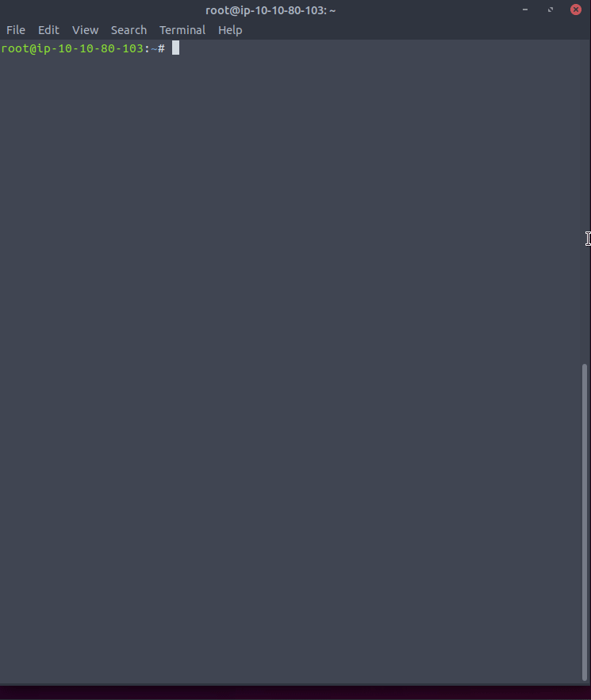

# SSHBruteForcer

## Description:
### SSHBruteForcer Python program created for educational purposes.

## Accepts the following parameters
1. -t target ip
2. -p target port
3. -u ssh username to bruteforce
4. -w passwords wordlist

